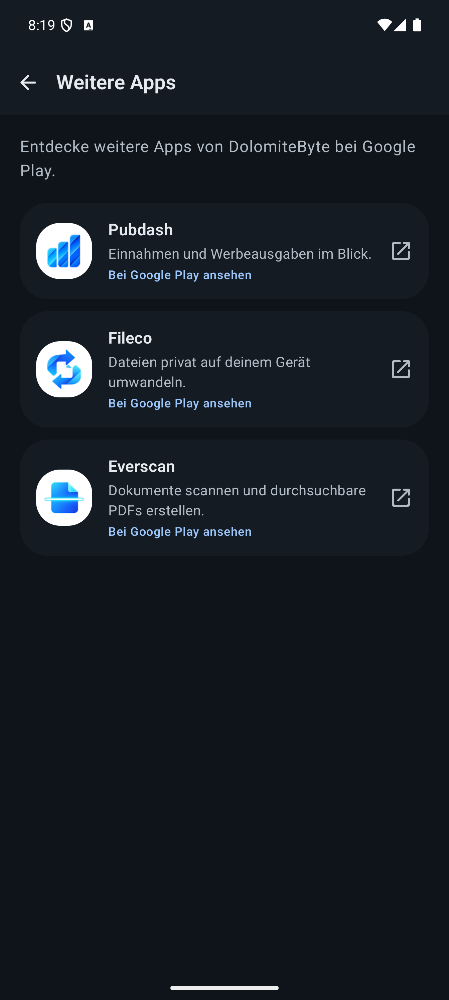
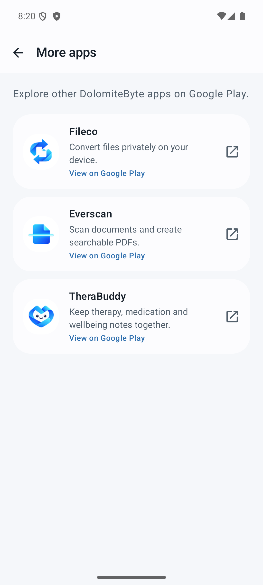

# DolomiteByte More Apps

[Deutsch](README.de.md) · English

A shared Jetpack Compose Material 3 destination for discovering other DolomiteByte Android apps. The catalogue, copy, icons, and Google Play navigation live in this repository; each host app decides where the entry point belongs and supplies its own theme.

This is a **source module** used by Pubdash, TookAction, Fileco, Everscan, and TheraBuddy. It is not published as a Maven artifact.

| Dark theme · TheraBuddy | Light theme · Pubdash |
| :---: | :---: |
|  |  |

## What the library does

- Shows an explicit, first-party catalogue of DolomiteByte apps. It excludes the current host, including application IDs with suffixes such as `.debug`.
- Shows only entries marked `publishedOnPlay`. TookAction is present in the catalogue but currently hidden from other hosts.
- Opens an app's HTTPS Google Play listing **only after a tap**. It tries the Play Store first and falls back to another app that handles the URL, such as a browser.
- Uses the host's `MaterialTheme` and includes English and German strings. Other locales use Android's default English resources.
- Bundles its catalogue and icons locally. It does not request permissions, fetch a remote catalogue, track taps, or install apps.

## Requirements

| Requirement | Value |
| --- | --- |
| Minimum Android API | 26 |
| Compile SDK | 36 or newer in the consuming app |
| UI | Jetpack Compose with Material 3 |
| Standalone build | Gradle Wrapper 9.7.1, Android Gradle Plugin 9.3.2, Kotlin Compose plugin 2.4.10 |

The consuming app owns its navigation and Material 3 theme. The versions above describe this repository's tested standalone build; host builds must resolve compatible Android and Compose plugins.

## Integrate into an Android app

The five DolomiteByte hosts pin a reviewed commit of this repository as a Git submodule at `shared/more-apps`.

### 1. Add or check out the submodule

For a new host repository:

```sh
git submodule add https://github.com/DolomiteByte/more-apps-android.git shared/more-apps
```

After cloning a host that already contains the submodule:

```sh
git submodule update --init --recursive
```

In GitHub Actions, configure `actions/checkout` with `submodules: true`. The submodule is public, so fetching it does not require a separate private-repository token.

### 2. Register the module with Gradle

In the host's `settings.gradle.kts`:

```kotlin
include(":moreapps")
project(":moreapps").projectDir = file("shared/more-apps")
```

In the host app's `build.gradle.kts`:

```kotlin
dependencies {
    implementation(project(":moreapps"))
}
```

The host's root build must also make `com.android.library` and `org.jetbrains.kotlin.plugin.compose` available to the module. Add `com.android.library` with `apply false` if the host only declares `com.android.application`.

### 3. Add the destination

Use `MoreAppsScreen` when the library should provide the top app bar and back button:

```kotlin
import androidx.compose.runtime.Composable
import androidx.compose.ui.platform.LocalContext
import com.dolomitebyte.moreapps.MoreAppsScreen

@Composable
fun MoreAppsDestination(onBack: () -> Unit) {
    val context = LocalContext.current

    AppTheme {
        MoreAppsScreen(
            hostPackageName = context.packageName,
            onBack = onBack,
        )
    }
}
```

`AppTheme` stands for the host's own Material 3 theme. Pass the **runtime application ID** (`context.packageName` or `BuildConfig.APPLICATION_ID`) so debug and QA variants also exclude their own app.

Use `MoreAppsContent` when the host already provides a toolbar and back navigation. Add a labeled **More apps** item below Settings in a side drawer, or inside Settings when the app has no drawer. The localized label is `com.dolomitebyte.moreapps.R.string.more_apps_title`.

| Host | Entry point | Destination |
| --- | --- | --- |
| Pubdash | Side drawer, below Settings | `MoreAppsScreen` |
| TookAction | Side drawer, below Settings | `MoreAppsContent` inside its existing scaffold |
| Fileco | Settings | `MoreAppsScreen` |
| Everscan | Side drawer, below Settings | `MoreAppsScreen` |
| TheraBuddy | Side drawer, below Settings | `MoreAppsScreen` |

## API reference

| API | Purpose |
| --- | --- |
| `MoreAppsScreen(hostPackageName, onBack, modifier, onOpenApp)` | Complete Material 3 destination with its own top app bar. |
| `MoreAppsContent(hostPackageName, modifier, onOpenApp)` | Catalogue content for a host-owned scaffold. |
| `moreAppsFor(hostPackageName)` | Returns published entries, excluding the host app and its build variants. |
| `openGooglePlayListing(context, app)` | Sends a user-initiated `ACTION_VIEW` intent to the Play Store, then an HTTPS fallback. |
| `DolomiteApp` | The allowlisted package IDs, localized resources, icons, and publication flags. |

`onOpenApp` is optional. When supplied, it replaces the default store-opening action; the host can use it for custom navigation or error handling. `openGooglePlayListing` returns `true` when an activity accepted the intent, **not** when the listing loaded or an installation completed.

## Catalogue and release workflow

| App | Application ID | Shown in other hosts |
| --- | --- | --- |
| Pubdash | `com.dolomitebyte.pubdash` | Yes |
| TookAction | `com.dolomitebyte.tookaction` | No — `publishedOnPlay = false` |
| Fileco | `com.dolomitebyte.fileco` | Yes |
| Everscan | `com.dolomitebyte.everscan` | Yes |
| TheraBuddy | `com.dolomitebyte.therabuddy` | Yes |

The list is an allowlist, not Play Store discovery. To add or release an entry:

1. Verify that its package ID has a reachable, public Google Play listing for the intended audience.
2. Update `DolomiteApp`, its English and German strings, and its icon. Set `publishedOnPlay = true` only after that verification.
3. Run the unit tests and assemble a debug build. Check the list from at least one other host and its own-host exclusion.
4. Review the new library commit, then advance the pinned submodule commit in each host app and build those apps.

## Google Play policy scope

Google's [app-content guidance](https://support.google.com/googleplay/android-developer/answer/9859455?hl=en) gives a main-menu **More Apps** section linking to a developer's other apps as an example in its ads-declaration guidance. It distinguishes that pattern from house-ad banners and interstitials. Google's [App Promotion policy](https://support.google.com/googleplay/android-developer/answer/9899004?hl=en) prohibits misleading promotion and redirects without informed user action.

This library uses a clearly labeled destination and opens a listing only after the user taps an app. Each host remains responsible for its **overall** ads declaration, privacy disclosures, store listing, and current Play policy compliance; this module does not determine those declarations.

## Build and verify

Install JDK 21 and Android SDK Platform 36, then use the included Gradle Wrapper:

```sh
./gradlew testDebugUnitTest assembleDebug
```

On Windows:

```powershell
.\gradlew.bat testDebugUnitTest assembleDebug
```

The unit tests cover host exclusion, debug application IDs, and unpublished entries. The Compose file includes preview-safe examples for a full screen and content-only layout. Host apps should also preview their own navigation placement under their own themes.

## Repository layout

```text
src/main/java/com/dolomitebyte/moreapps/
  MoreAppsCatalog.kt       Allowlist and host filtering
  MoreAppsScreen.kt        Material 3 UI and previews
  GooglePlayLinks.kt       Play Store intent and HTTPS fallback
src/main/res/
  drawable-nodpi/          First-party app icons
  values/                  English strings
  values-de/               German strings
src/test/                  Catalogue unit tests
docs/images/               Emulator screenshots used above
```

## Distribution and licensing

This public repository exists to make the shared source available to DolomiteByte's app builds. There is currently no Maven release or `LICENSE` file; terms for third-party reuse have not been specified.
